### British_Airways

---
### Table of Contents
1.  [Overview](#overview)
2. [Introduction](#introduction)
3. [Objectives](#objectives)
4. [Data source](#data-source)
5. [Skills Demonstrated](#skills-demonstrated)
6. [Modelling](#modelling)
7. [Visualizations](#visualizations)
8. [Insights](#insights)
9. [Recommendations](#recommendations)

---
### Overview
This repository contains a Power BI analysis of British Airways flight performance for a duration of six months. The analysis covers key performance indicators (KPIs), flight operations, and financial performance to provide actionable insights.

---
### Introduction
The British Airways is located in the United Kingdom, London and is the second largest UK based airline on fleet size(i.e. total number of aircrafts in an airline and total passengers carried). British Airways operates a vast network of flights and connects passengers to their destinations worldwide. 

---
### Objectives
The objective of this data is to answer the following questions:
1. Which manufacturer has the best aircrafts in terms of fuel_efficiency?
2. Does British Airways tend to use aircraft from manufacturers known for there superior fuel efficiency more frequently?
3. Which month did passengers cancel flights the most?
4. Which city do passengers travel to the most?
5. What is the revenue generated from baggage overtime?
6. What is the average number of passengers like for each month?
   
---
### Data source
The data used for this project are 4 different excel csv files [British_Airway](https://kaggle.com) viz; the flights table with different colums, the flight routes table, the fuel_efficiency table and aircraft table.

---
### Skills demonstrated
- Uing Microsoft Excel: Cleaned the data in all 4 tables by handling missing values, removing duplicates and standardized formats
- Using SQL: Created a database and also tables in other to import the tables from Excel into the SQL database.
  -  Queried the database to extract the results from the different questions asked by the organisation.
- Using Power BI:
  - Connected the SQL to Power BI server.
  - loaded the already cleaned tables to power query editor
  - Created a calendar table as well as different DAX formulas
  - reconnected the relationships in the data model
  - Designed different visuals for my dashboard as regards the questions being asked
  - Added tooltips to visuals
  
--- 
### Modelling
The model is a star schema, with one fact table and 3 dimensional tables. The dimension tables are joined to the fact table with a one-to-many relationship.
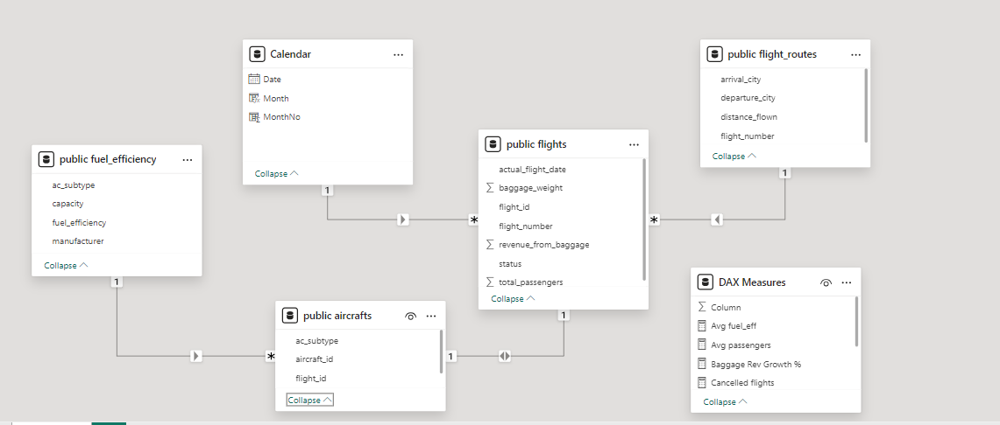

---
### visualizations
This is a one page report dashboard. Alongside visuals of the SQL queries

**Dashboard**

The dashboard has 4 KPIs with growth percentages, 5 visuals of a line,bar,pie,map charts and 2 slicers.

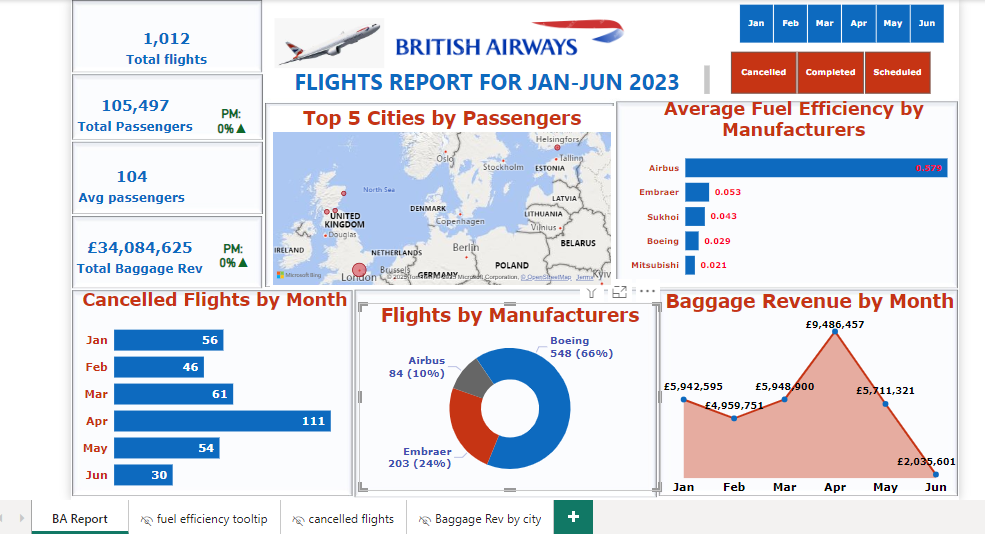

**Tables created in sql**
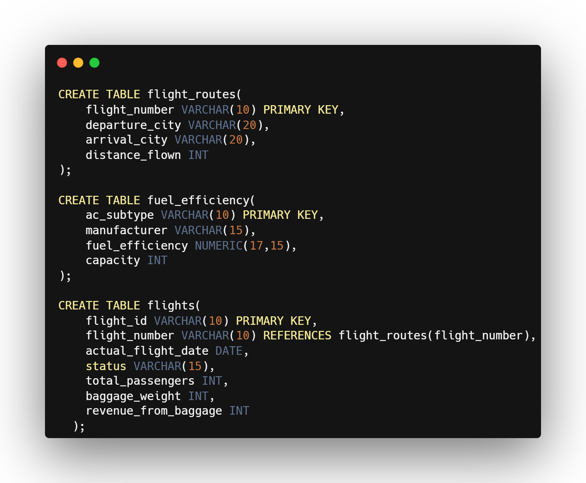

1. Which manufacturer has the best aircrafts in terms of fuel_efficiency?

| Query                        |                      Results |
|----------------------------- | -----------------------------|
|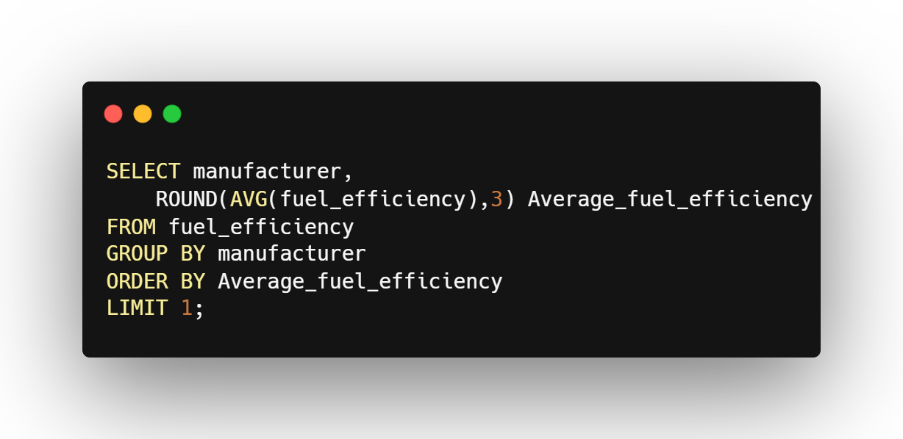               |        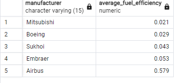|

2. Does British Airways tend to use aircraft from manufacturers known for there superior fuel efficiency more frequently?

| Query                        |                      Results |
|----------------------------- | -----------------------------|
|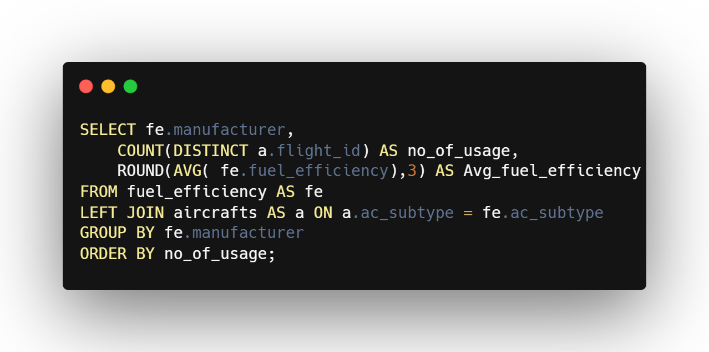               |        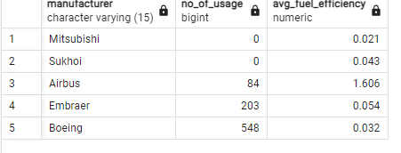|

3. Which month did passengers cancel flights the most?
   
| Query                        |                      Results |
|----------------------------- | -----------------------------|
|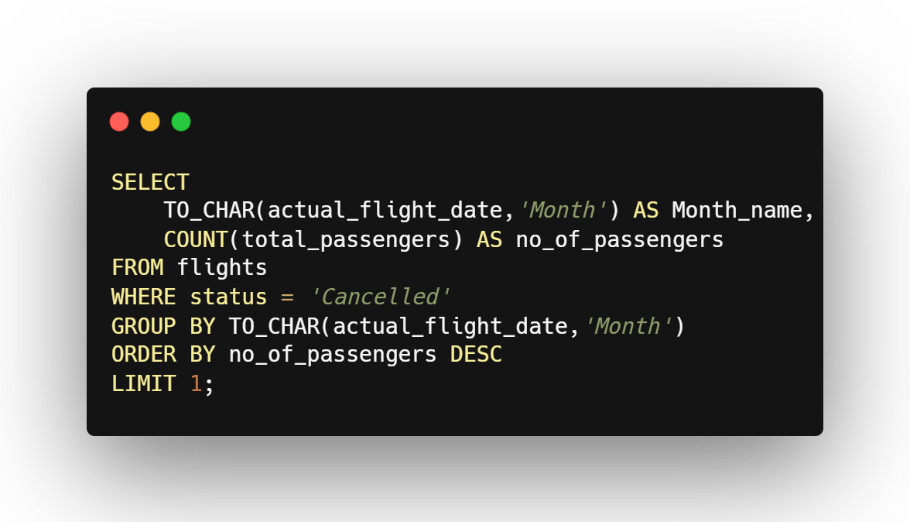               |        |

4. Which city do passengers travel to the most?
   
| Query                        |                      Results |
|----------------------------- | -----------------------------|
|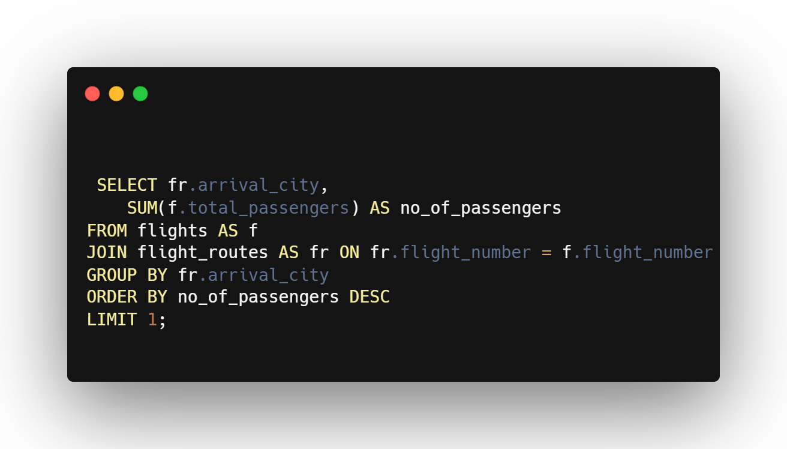               |        |

5. What is the revenue generated from baggage overtime?
   
| Query                        |                      Results |
|----------------------------- | -----------------------------|
|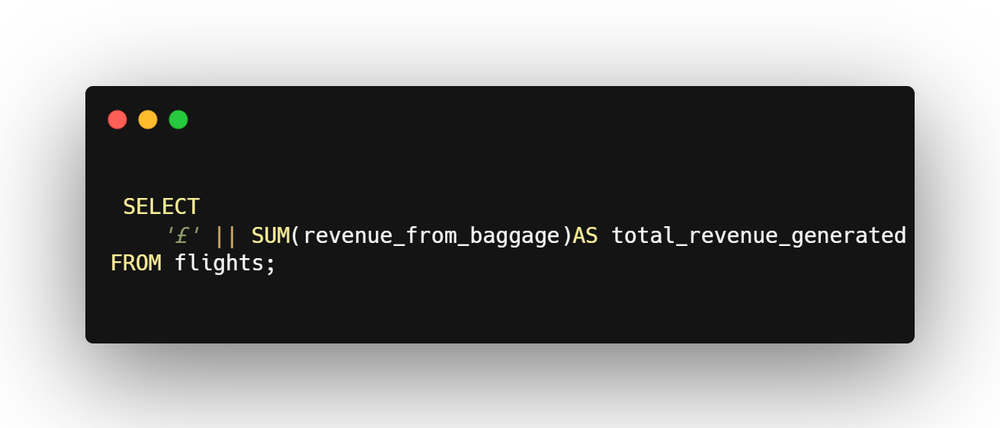               |        |

6. What is the average number of passengers like for each month?
    
| Query                        |                      Results |
|----------------------------- | -----------------------------|
|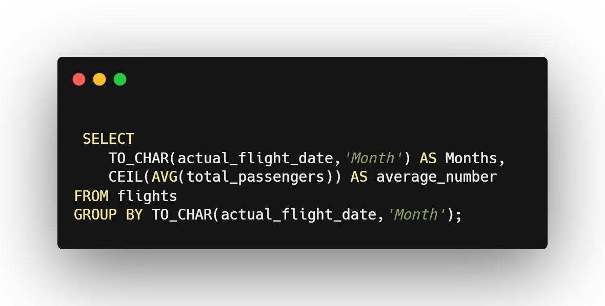               |        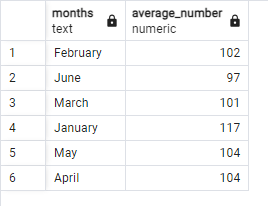|

---
### Insights
The British Airways flight data for January to June,2023 has incomplete data for the month of June.

Total flight: **1,012**

Total passengers: **105,000**

Total baggage revenue: **£34,084,625**

Average passenger: **104**

- From the data gotten, British Airways has 14 aircrafts from 5 maunfacturers(Boeing, Airbus, Mitsubishi,Embraer and Sukhoi) having varying fuel_efficiency value.
Airbus has a manufacturer has 3 aircrafts,Embraer has 2 aircrafts,sukhoi has 1 aircraft, Boeing has 7 aircrafts and Mitsubushi has 1 aircraft. As a result of some manufacturers having more than one aircraft the average fuel-efficiency of all 14 aircrafts was calculated and Mitsubishi had the lowest average fuel-efficiency

  | Manufacturer  | Avg fuel-efficiency |
  | --------------|-------------------- |
  | Mitsubishi    |	0.021              |
  | Boeing	      |  0.029              |
  | Sukhoi	      |  0.043              |
  | Embraer	      |  0.053              |
  | Airbus	      |  0.579              |

- British airways tend to use aircraft  from manufacturers known for their superior fuel-efficiency more often. From the 5 manufacturers only 3 manufacturers(Airbus, Boeing and Embraer) were used. Boeing manufacturer has 2 aircraft subtype with low fuel efficiency and was used most frequently for the 6 months period. Despite Mitsubishi manufacturer having the lowest(best) average fuel-efficiency it wasn't used. Maybe because the MJR aircraft by Mitsubishi manufacturer do no correspond with passenger's demand routes or the BA network does not reach any of the 88 routes and this would restrict passenger's access. It could also be that MJR aircraft was not used for the 6 months period or could even be undergoing maintenance during this period.

- The month of April had the most number of cancelled flights of **111** and most of the cancellations occured in London in all the months. March had a total of **61** cancelled flights, january had a total of **56** cancelled flights May, February and June(with 15 days) had a total cancelled flights of **54**, **46** and **30** respectively.

- The top 5 cities passengers travel to the most are **London** with *50,051* passengers, Helsinki with *4,662* passengers, Glasgow with *3,649* passengers, Edinburgh with *3,130* passengers and Aberdeen with *2,867* passengers.

- The total revenue generated from baggage revenue overtime was **£34,084,625**. Baggage revenue is the revenue generated by an airline from fees charged to passsengers for checking in luggages and carrying additional or oversized baggages. The bagage revenue varied by month with April compared to other months generating the highest baggage revenue of over £9 million also having London as the city with the highest baggage revenue.

- The month of May had the highest average number of passengers being *104* followed by April with *103*, February with *102*, March with *100* and January had the least average number of passengers of 17.

---
### Recommendations
- A lower fuel_efficiency value indicates better performance because it shows less fuel is needed to travel a long distance. Therefore, Mitsubishi having the least average fuel_efficiency value of *0.021* is considered to be the best fuel_efficient aircraft. However, Boeing aircrafts are fuel-efficient and should be used.
  
- To improve fuel-efficiency, the use of aircraft from manufacturers with the best fuel-efficiency should be used on high demand routes. Also, investments should be made on newer fuel-efficient aircrafts like Boeing 77W and older less fuel-efficient aircraft like Airbus 332 should be phased out to improve over all fleet fuel-efficiency.

- To improve the baggage revenue for other months and cities, baggage fees should be optimized by offering bundled packages to passengers that includes baggage fees with other services like seat selection and inflight meals. Additionally, implement competitive pricing strategies for flights to these cities to attract more passengers.

- To address the issue of high flight cancellation in April particularly in London, analyse the root cause of cancellation by examining issues like maintenance schedule and aircraft availability to alleviate the causes of cancellations. Also, schedule preventive maintenance of aircrafts in months that are known to have low demand in other to minimize disruptions during peak travel periods.

- 

